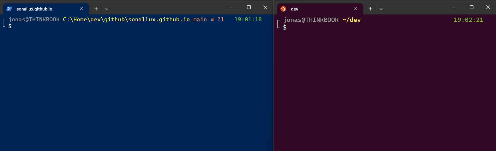

If you are a Windows user and you use Powershell und WSL, then I can recommend [Oh My Posh](https://ohmyposh.dev).

<!--truncate-->

## What is "Oh My Posh"?

[Oh My Posh](https://ohmyposh.dev) is a prompt theme engine written in Go. It supports most of the popular shells (Bash, Powershell, zsh, Fish, ...) and works cross platform on Windows, Linux and MacOS. Think of it like oh-my-zsh, but for all shells and platforms. Define your theme once and use it on any shell and any platform.

## Why do I use it?

Because I am using Powershell on Windows and Bash on Linux I hat two completely different setups before knowing about Oh My Posh. With Powershell I used [posh-git](https://github.com/dahlbyk/posh-git) and with Bash I used [bash-git-prompt](https://github.com/magicmonty/bash-git-prompt). This setup worked, but it was tidious to maintain and update.

After I found Oh My Posh my setup is much simplier. I have defined [my own custom theme](https://github.com/sonallux/oh-my-posh-theme) once and can reuse it everywhere.

